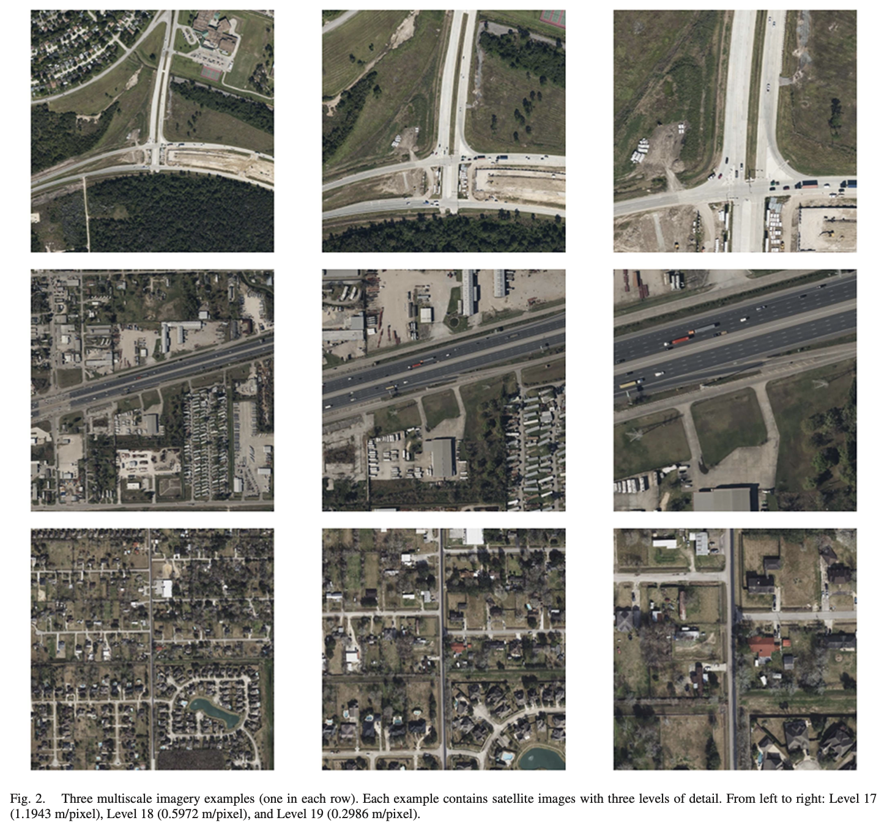

## Unveiling Roadway Hazards: Enhancing Fatal Crash Risk Estimation Through Multiscale Satellite Imagery and Self-Supervised Cross-Matching [[Paper](https://ieeexplore.ieee.org/stamp/stamp.jsp?tp=&arnumber=10313931)]
#### [Gongbo Liang](http://www.gb-liang.com), [Janet Zulu](https://www.linkedin.com/in/janetzulu/), [Xin Xing](https://xtrigold.github.io), [Nathan Jaocbs](https://jacobsn.github.io/) 


### Abstract
Traffic accidents threaten human lives and impose substantial financial burdens annually. Accurate estimation of accident fatal crash risk is crucial for enhancing road safety and saving lives. This paper proposes an innovative approach that utilizes multi-scale satellite imagery and self-supervised learning for fatal crash risk estimation. By integrating multi-scale imagery, our network captures diverse features at different scales, encompassing observations of surrounding environmental factors in low-resolution images that cover larger areas and learning detailed ground-level information from high-resolution images. One advantage of our work is its sole reliance on satellite imagery data, making it an efficient and practical solution, especially when other data modalities are unavailable. With the ability to accurately estimate fatal crash risk, our method exhibits a potential for enhancing road safety, optimizing infrastructure planning, preventing accidents, and ultimately saving lives. 


### The Dataset
The dataset contains ~16K positive image sets and ~64K negative image sets of three major metropolitan areas and one costal city in Texax, namely the Greater Houston area, Dallas-Fort Worth-Arlington metropolitan area, San Antonio–Austin metroplex, and Corpus Christi.


Each image sets contains the satellite images of three zoom levels (i.e., 17, 18, and 19) of the same location. In total, the dataset contains ~240K satellite images.

Positive samples are the locations where fatal crashes happened between 2010-2020. And, negative samples are randomly collected from locations that close to positive samples (within 1000 meters to a positive location but more than 500 meters from any positive locations).

The dataset is available to researchers on request. Please contact gliang[at]tamusa.edu for more about requesting the access to the dataset.


### About the Code
The code in this repository is provided for demostration purposes. 
- The ```code/pre-training.ipynb``` demonstrates the training of the Multi-Scale Cross-Matching SSL pre-training.
  
- The ```code/FatalCrashRiskLearning.ipynb``` demonstrates the training (i.e., finetuning) of the Fatal Crash Risk Estiamtion model.
  


### 📑 Citation
```bibtex
@ARTICLE{liang2024unveiling,
  author={Liang, Gongbo and Zulu, Janet and Xing, Xin and Jacobs, Nathan},
  journal={IEEE Journal of Selected Topics in Applied Earth Observations and Remote Sensing}, 
  title={Unveiling Roadway Hazards: Enhancing Fatal Crash Risk Estimation Through Multiscale Satellite Imagery and Self-Supervised Cross-Matching}, 
  year={2024},
  volume={17},
  pages={535-546},
  doi={10.1109/JSTARS.2023.3331438}}
```
